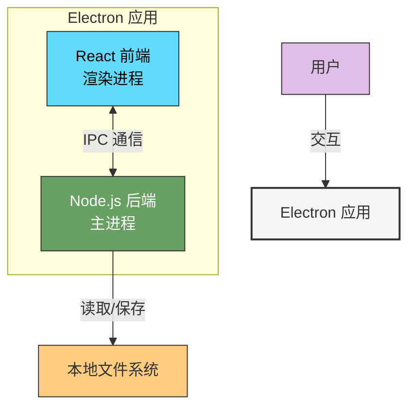
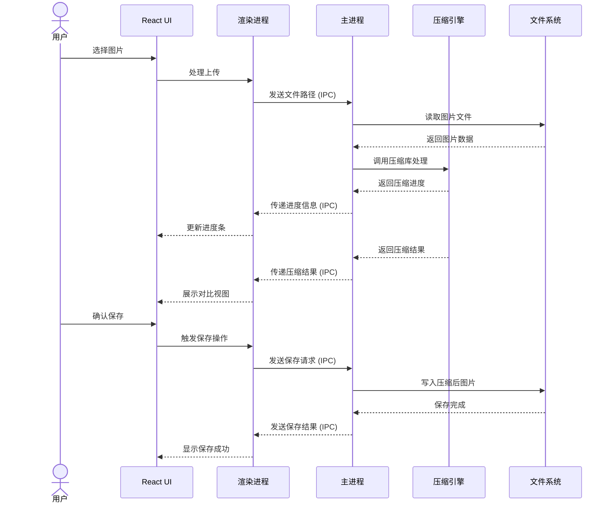
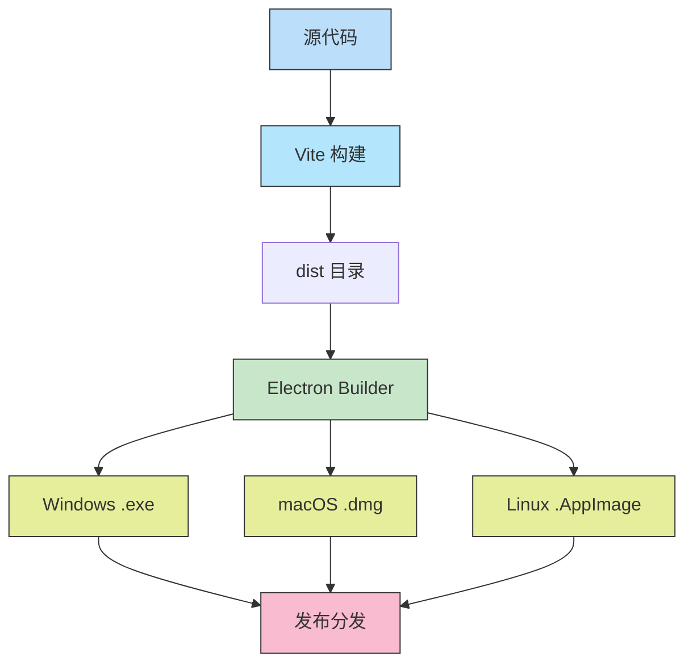

# 图片压缩工具技术架构流程图

本文档通过流程图方式展示图片压缩工具的技术架构，帮助直观理解系统组件和数据流向。

## 1. 系统整体架构



## 2. 数据流向图

```mermaid
flowchart LR
    User[用户] --> UI[React UI]
    
    subgraph "前端 (渲染进程)"
        UI --> Upload[图片上传组件]
        UI --> Options[压缩选项组件]
        UI --> Compare[对比视图组件]
        UI --> Save[保存结果组件]
        
        Upload --> IPCSend[IPC 发送器]
        Options --> IPCSend
        Save --> IPCSend
        
        IPCReceive[IPC 接收器] --> Compare
        IPCReceive --> Progress[进度组件]
    end
    
    subgraph "后端 (主进程)"
        IPCHandler[IPC 处理器] --> FileManager[文件管理器]
        IPCHandler --> CompressionEngine[压缩引擎]
        
        FileManager --> FileOps[文件操作]
        CompressionEngine --> Sharp[Sharp 库]
        CompressionEngine --> ImageMin[ImageMin 库]
        
        FileOps --> Result[结果处理]
        Sharp --> Result
        ImageMin --> Result
        
        Result --> IPCResponse[IPC 响应]
    end
    
    IPCSend --->|文件路径/选项| IPCHandler
    IPCResponse --->|压缩结果/进度| IPCReceive
    
    FileOps <-->|读写操作| Files[本地文件系统]
    
    style User fill:#e1bee7,stroke:#333
    style "前端 (渲染进程)" fill:#cce5ff,stroke:#333,stroke-width:2px
    style "后端 (主进程)" fill:#d9ead3,stroke:#333,stroke-width:2px
    style Files fill:#ffcc80,stroke:#333
```

## 3. 图片压缩流程



## 4. 组件关系图

```mermaid
graph TD
    subgraph "Electron 应用"
        subgraph "React 前端 (Vite)"
            App[App.jsx] --> Pages[页面组件]
            Pages --> Home[Home.jsx]
            Pages --> Settings[Settings.jsx]
            
            Home --> Components[核心组件]
            Components --> Uploader[ImageUploader.jsx]
            Components --> Preview[ImagePreview.jsx]
            Components --> CompView[ComparisonView.jsx]
            Components --> Options[CompressionOptions.jsx]
            Components --> Progress[ProgressBar.jsx]
            
            App --> Contexts[Context API]
            Contexts --> Theme[主题上下文]
            Contexts --> Images[图片数据上下文]
            Contexts --> Compression[压缩状态上下文]
        end
        
        subgraph "Node.js 后端"
            Main[main.js] --> Preload[preload.js]
            Main --> Services[服务模块]
            
            Services --> CompService[compression.js]
            Services --> FileMgr[file-manager.js]
            Services --> IPCHandlers[ipc-handlers.js]
            
            CompService --> SharpLib[Sharp 库]
            CompService --> ImageMinLib[ImageMin 库]
        end
    end
    
    style "React 前端 (Vite)" fill:#cce5ff,stroke:#333,stroke-width:1px
    style "Node.js 后端" fill:#d9ead3,stroke:#333,stroke-width:1px
    style "Electron 应用" fill:#f5f5f5,stroke:#333,stroke-width:2px
```

## 5. 打包和分发流程



以上流程图使用 Mermaid 语法编写，可以在支持 Mermaid 的 Markdown 查看器中正确渲染。这些图表展示了图片压缩工具的架构层次、组件关系、数据流向和执行流程，帮助团队更直观地理解系统架构。 